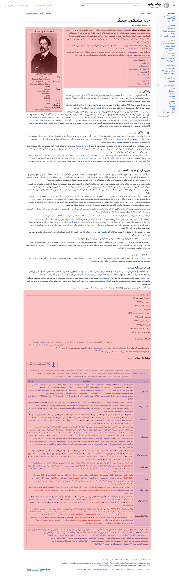
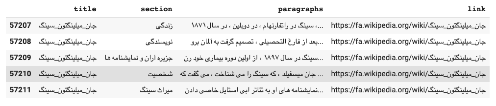
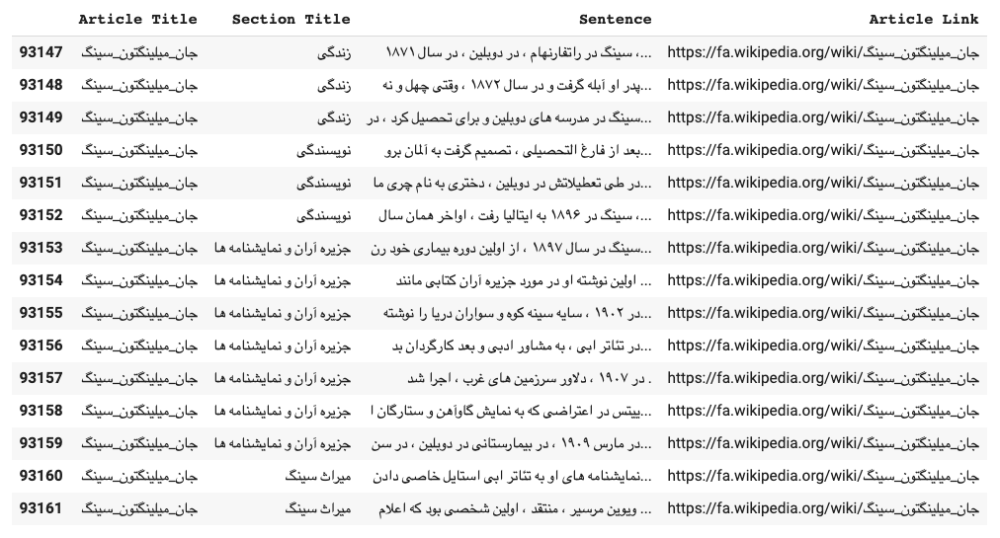
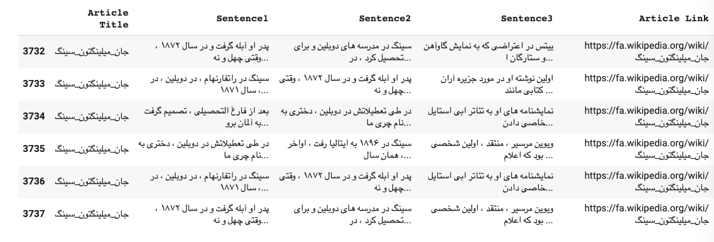
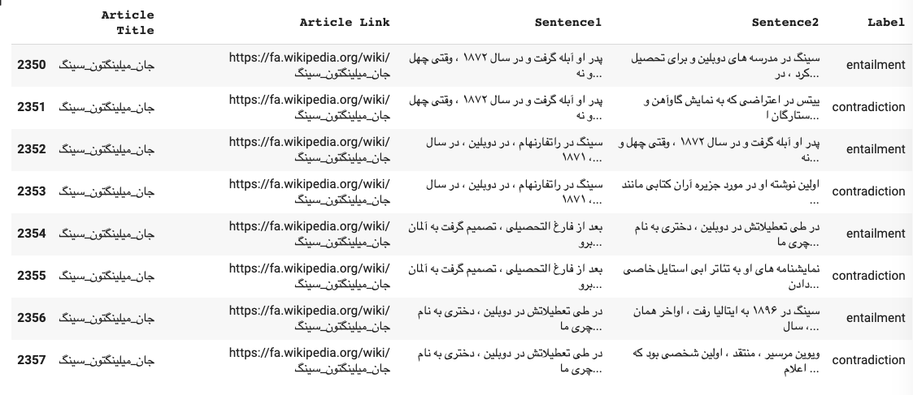

# Sentence Transformers
> Sentence Embeddings with BERT

There are many achievements in the Natural Language field for English or even other languages, but in the case of Persian, as you can see, there are not many. 
Perhaps the lack of data resources, non-disclosure of sources by research groups, and decentralized research communities are the main reasons for Persian's current state. 

Of course, it should be noted that some of the research groups concern about this matter and share their results, thoughts, and resources with others, but still, we need more.

NLI (known as recognizing textual entailment) resources for Persian are vital for every semantic, extraction, and inference system. 
I was so excited when [FarsTail](https://github.com/dml-qom/FarsTail), as the first NLI dataset for Persian, was released. 
I used this dataset to train a Sentence-Transformer model (using [ParsBERT](https://github.com/hooshvare/parsbert)) as a basis for other applications like Semantic Search, Clustering, Information Extraction, Summarization, Topic Modeling, and some others. 
However, the model could be achieved remarkable results on recognizing entailment (81.71%) in contrast to what they mentioned in their [paper](https://arxiv.org/abs/2009.08820) (78.13%), still not adequate for NLI applications.

I dug in the official paper of Sentence-Transformer [Reimers and Gurevych, 2019](https://arxiv.org/abs/1908.10084). 
I found that it used the Wikipedia-Triplet-Sections, introduced by [Dor et al., 2018](https://www.aclweb.org/anthology/P18-2009/), to train the SBERT for recognizing entailment task. 
[Dor et al., 2018](https://www.aclweb.org/anthology/P18-2009/), presume that sentences in the same section are thematically closer than sentences in different sections. 
They presented the anchor () and the positive () example from the same section, while the negative example () comes from a separate section of the same article.
They designated the following steps to generate this sentences-triplet dataset (In each rule, I would specify whether to use the principal or not):

1. Exploit Wikipedia partitioning into sections and paragraphs, using OpenNLP for sentence extraction.
2. Apply the following rules and filters to reduce noise and to create a high-quality dataset, ‘triplets-sen’:
    1. The maximal distance between the intra-section sentences is limited to three paragraphs. (Change this rule into two terms, inner and outer part. The sentences from the outer part () must be with a distance of at least two sections. The sentences from the inner part () must be a distance of at most two paragraphs.)
    2. Sentences with less than 5 or more than 50 tokens are filtered out. (Change this relation into 10 < length of word tokens < 130.)
    3. The first and the ”Background” sections are removed due to their general nature. (Do the same.)
    4. The following sections are removed: "External links", "Further reading", "References", "See also", "Notes","Citations" and "Authored books". These sections usually list a set of items rather than discuss a specific subtopic of the article’s title. (Add a few more filters: محتویات-پانویس-منابع-منابع و پانویس-جستارهای وابسته-پیوند به بیرون-یادداشت‌ها-یادداشت‌ ها-جوایز-نگارخانه-روابط‌خارجی-روابط خارجی-کتاب‌شناسی-کتاب‌ شناسی-فیلم‌شناسی-فیلم ‌شناسی-دست‌اندرکاران-دست‌اندر کاران-دست‌ اندر کاران-فروش‌های برگزیدهٔ آلبوم-فروش‌ های برگزیدهٔ آلبوم-فروش‌ های برگزیده آلبوم-نمودارهای فروش-نمودار های فروش-فهرست آهنگ‌ها-فهرست آهنگ‌ ها-اعضا-ترانه‌شناسی-ترانه‌ شناسی-نگارخانه-بازیگران-پروژه‌های مشابه-پروژه‌ های مشابه)
    5. Only articles with at least five remaining sections are considered to focus on articles with rich enough content. (Skip this rule.)
 
[Reimers and Gurevych, 2019](https://arxiv.org/abs/1908.10084) use the dataset with a Triplet Objective to train the SBERT.

<p align="center">
    
    <br>
    <em>Eq 1: Triplet Objective Function, try to minimize the above loss function.</em>
</p>

**Tips:** SBERT adds a pooling operation to the output of BERT / RoBERTa to derive a fixed-sized sentence embedding. They experimented with three pooling strategies:

- Using the production of the CLS-token.
- Computing the mean of all output vectors (Mean-Strategy).
- Computing a max-over-time of the output vectors (Max-Strategy).

In this case,  I use ***Mean-Strategy***.

In the following parts, I would show you how to do these rules step by step. 
Before going any further, I noticed that some of the Wikipedia articles are entirely English or other languages than Persian, like "اف_شارپ", "سی_شارپ", and some others which must be removed. 
So, I add a bunch of preprocessing steps into the above rules.

## Preprocessing Rules

The preprocessing steps are as follow:

1. Remove or filter some special characters which are used more by Wikipedia users or Persian users (_, «, [[, [ [, separated domains, ه ی, هٔ, أ).
2. Remove user tag, hashtag, and underscore but keep the text.
3. Remove emojis in every mode.
4. Preprocess and normalize text at the low level using the clean-text and hazm packages.
    1. Fix Unicode.
    2. Filter emails, URLs, numbers, phone numbers, digits, currency symbols, and punctuations.
    3. Make text lower case.
    4. Clean HTML tags.
    5. Normalize text into Persian characters.
5. Remove weird Unicode.
6. Remove redundant spaces (keep the newlines).
7. Remove articles which have more non-Persian characters (with a threshold of 0.7)

## In Action
A Wikipedia article sample is shown in Fig 1. 
The red boxes were removed due to the Dor et al., 2018 rules.  

<p align="center">
    <a href="assets/sample-wiki.png"></a>
    <br>
    <em>Fig 1: Wikipedia Article Sample "جان میلینگتون سینگ"</em>
</p>


The following figure (Fig 2) shows the article after passing the mutated Dor et al., 2018 rules and preprocessing steps known as the Wikipedia-Section-Paragraphs.

<p align="center">
    <a href="assets/P-1.png"></a>
    <br>
    <em>Fig 2: Wikipedia-Section-Paragraphs.</em>
</p>

Then, we need to convert the section-paragraphs into section-sentences in order to have a recognizing entailment dataset. The following steps need to replace with some of the rules defined by Dor et al., 2018.

1. Remove these trivial sections (محتویات-پانویس-منابع-منابع و پانویس-جستارهای وابسته-پیوند به بیرون-یادداشت‌ها-یادداشت‌ ها-جوایز-نگارخانه-روابط‌خارجی-روابط خارجی-کتاب‌شناسی-کتاب‌ شناسی-فیلم‌شناسی-فیلم ‌شناسی-دست‌اندرکاران-دست‌اندر کاران-دست‌ اندر کاران-فروش‌های برگزیدهٔ آلبوم-فروش‌ های برگزیدهٔ آلبوم-فروش‌ های برگزیده آلبوم-نمودارهای فروش-نمودار های فروش-فهرست آهنگ‌ها-فهرست آهنگ‌ ها-اعضا-ترانه‌شناسی-ترانه‌ شناسی-نگارخانه-بازیگران-پروژه‌های مشابه-پروژه‌ های مشابه).
2. For each remaining section, split them into paragraphs. If the length of the paragraphs is greater than two, move forward.
3. For each paragraph, tokenize text into sentences. If the length of the sentences is greater than two, move forward.
4. For each sentence in a paragraph, tokenize text into words. If the words' length is greater than 10, pick the first sentence; otherwise, merge the following sentences until the tokenized words' size be greater than 10.

The following figure (Fig 3) presents the article after passing the mutated rules known as the Wikipedia-Section-Sentences.

<p align="center">
    <a href="assets/P-2.png"></a>
    <br>
    <em>Fig 3: Wikipedia-Section-Sentences.</em>
</p>


Then, I compose a combination of sections in an article with a distance of at least two segments concerning their orders. Suppose that we have an article with four sections. 
The outcome of this composition shown as follow:

- **Article Sections** 

```python
sections = ['Section 1', 'Section 2', 'Section 3', 'Section 4']
```

- **Composition Sections**

```python
composition = [['Section 1', 'Section 4'], ['Section 1', 'Section 3'], ['Section 2', 'Section 4']]
```

Each pair-sections shows the order of sentence extraction. For example, the pair ['Section 1', 'Section 4'] specifies that the anchor and positive examples must be chosen from `Section 1` and the negative example from `Section 4`. Also, consider that the selected anchor and positive examples from `Section 1` should be chosen from paragraphs with a distance of at most two in that section, shown in Fig 4. 

<p align="center">
    <a href="assets/P-3.png"></a>
    <br>
    <em>Figure 4: Wikipedia-Triplet-Sentences.</em>
</p>

**Examples**

| Sentence1 ()                                   	| Sentence2 ()                                                                           	| Sentence3 ()                                           	|
|-------------------------------------------------------------------------------------------------------------------	|-----------------------------------------------------------------------------------------------------------------------------------------------------------	|---------------------------------------------------------------------------------------------------------------------------	|
| جنبش های اجتمای دیگر ، از جمله موج اول فمینیسم ، رفرم اخلاقی و جنبش های میانه رو نیز در توسعه ونکوور مؤثر بودند . 	| ادغام پوینت گری و ونکوور جنوبی به شهر ونکوور ، آخرین مرزبندی های شهری را رقم زد و مدتی بعد آن را به سومین کلان شهر کانادا تبدیل کرد .                     	| در سال ۲۰۰۸ ، در میان ۲۷ کلان شهر کانادا ، ونکوور هفتمین آمار جرم و جنایت را داشت که از سال ۲۰۰۵ ، سه پله سقوط کرده بود . 	|
| یکی از ویژگی های مهم سیستم های مالیاتی ، درصد بار مالیاتی مرتبط با درآمد یا مصرف است .                            	| یک مالیات صعودی ، مالیاتی است که به گونه ای اعمال می شود که وقتی مبلغی که به آن مالیات اعمال می شود افزایش می یابد ، نرخ مالیات مؤثر نیز افزایش می یابد . 	| اضافه رفاه از دست رفته باعث تنظیم مالیات ها در تراز کردن (فرصت ها در) زمین بازی تجاری نمی شود .                           	|

As far as this mutated method can understand the entailment and thematic, we could use a similar procedure to extract the NLI dataset, shown in Fig 5.

<p align="center">
    <a href="assets/P-4.png"></a>
    <br>
    <em>Figure 5: Wikipedia-NLI.</em>
</p>

**Examples**

|                                                                              Sentence1                                                                              	|                                                                                       Sentence2                                                                                      	|        Label        	|
|:-------------------------------------------------------------------------------------------------------------------------------------------------------------------:	|:------------------------------------------------------------------------------------------------------------------------------------------------------------------------------------:	|:-------------------:	|
| در جریان انقلاب آلمان در سال های ۱۹۱۸ و ۱۹۱۹ او به برپایی تشکیلات فرایکورپس که سازمانی شبه نظامی برای سرکوب تحرکات انقلابی کمونیستی در اروپای مرکزی بود ، کمک کرد . 	|                            کاناریس بعد از جنگ در ارتش باقی ماند ، اول به عنوان عضو فرایکورپس و سپس در نیروی دریایی رایش.در ۱۹۳۱ به درجه سروانی رسیده بود .                           	|  <br>entailment     	|
| در جریان انقلاب آلمان در سال های ۱۹۱۸ و ۱۹۱۹ او به برپایی تشکیلات فرایکورپس که سازمانی شبه نظامی برای سرکوب تحرکات انقلابی کمونیستی در اروپای مرکزی بود ، کمک کرد . 	| پسر سرهنگ وسل فرییتاگ لورینگوون به نام نیکی در مورد ارتباط کاناریس با بهم خوردن توطئه هیتلر برای اجرای آدمربایی و ترور پاپ پیوس دوازدهم در ایتالیا در ۱۹۷۲ در مونیخ شهادت داده است . 	|  <br>contradiction  	|
| شهر شیراز در بین سال های ۱۳۴۷ تا ۱۳۵۷ محل برگزاری جشن هنر شیراز بود .                                                                                               	| جشنواره ای از هنر نمایشی و موسیقی بود که از سال ۱۳۴۶ تا ۱۳۵۶ در پایان تابستان هر سال در شهر شیراز و تخت جمشید برگزار می شد .                                                         	|  <br>entailment     	|
| شهر شیراز در بین سال های ۱۳۴۷ تا ۱۳۵۷ محل برگزاری جشن هنر شیراز بود .                                                                                               	| ورزشگاه پارس با ظرفیت ۵۰ هزار تن که در جنوب شیراز واقع شده است .                                                                                                                     	|  <br>contradiction  	|


## Future Works
1. It is crucial to mention that the whole process was done on 21,515 articles due to the lack of computational resources. I believe that the model can achieve excellent results if it is trained on the entire Wikipedia articles.
2. What do you think (Let me know, in the repository issues)?  

## Dataset Information ( 😎 )

**Version 1.0.0**

- [Wikipedia Section Sentences](https://drive.google.com/uc?id=1uax1CncimQU-_kWvNigBONyplVRdi7PX)
- [Wiki Triplet](https://drive.google.com/uc?id=1-lfrhHZwleYR4s0xGkXZPXxTeF25Q4C3)
- [Wiki NLI](https://drive.google.com/uc?id=1801hoAM4hkGjFY8zUirPMPJ5hFzy7K4B)

### Wikipedia Sections Sentences

| Version 	| Examples 	| Titles 	| Sections 	|
|---------	|----------	|--------	|----------	|
| 1.0.0   	| 205,768  	| 21,515 	| 34,298   	|


### Wiki NLI

| Version 	| Train   	| Dev   	| Test  	|
|---------	|---------	|-------	|-------	|
| 1.0.0   	| 180,585 	| 5,586 	| 5,758 	|


### Wiki Triplet

| Version 	| Train   	| Dev   	| Test  	|
|---------	|---------	|-------	|-------	|
| 1.0.0   	| 126,628 	| 5,277 	| 5,497 	|

## Evaluation

The following table summarizes the scores obtained by each dataset and model.

| Model                                     	| Dataset     	| Metrics (%)                                                                     	|
|-------------------------------------------	|-------------	|---------------------------------------------------------------------------------	|
| parsbert-base-wikinli-mean-tokens         	| wikinli     	| Accuracy: 76.20                                                                 	|
| parsbert-base-wikinli                     	| wikinli     	| F1: 77.84,  Accuracy: 77.84                                                     	|
| parsbert-base-wikitriplet-mean-tokens     	| wikitriplet 	| Accuracy Cosinus: 93.33,  Accuracy Manhatten: 94.40,  Accuracy Euclidean: 93.31 	|
| parsbert-base-uncased-farstail            	| farstail    	| F1: 81.65,  Accuracy: 81.71                                                     	|
| bert-fa-base-uncased-farstail-mean-tokens 	| farstail    	| Accuracy: 56.45                                                                 	|


## How to use ( Applications )
| Application           	| Notebook                                                                                                                                                                                    	|
|-----------------------	|---------------------------------------------------------------------------------------------------------------------------------------------------------------------------------------------	|
| Semantic Search       	| [](https://colab.research.google.com/github/hooshvare/parsbert/blob/master/notebooks/Semantic_Search.ipynb)       	|
| Clustering               	| [](https://colab.research.google.com/github/hooshvare/parsbert/blob/master/notebooks/Clustering.ipynb)               	|
| Text Summarization    	| [](https://colab.research.google.com/github/hooshvare/parsbert/blob/master/notebooks/Text_Summarization.ipynb)    	|
| Information Retrieval 	| [](https://colab.research.google.com/github/hooshvare/parsbert/blob/master/notebooks/Information_Retrieval.ipynb) 	|
| Topic Modeling        	| [](https://colab.research.google.com/github/hooshvare/parsbert/blob/master/notebooks/Topic_Modeling.ipynb)        	|


## Model Releases
1.0.0: Hello World!

- [m3hrdadfi/bert-fa-base-uncased-wikinli-mean-tokens](https://huggingface.co/m3hrdadfi/bert-fa-base-uncased-wikinli-mean-tokens)
- [m3hrdadfi/bert-fa-base-uncased-wikinli](https://huggingface.co/m3hrdadfi/bert-fa-base-uncased-wikinli)
- [m3hrdadfi/bert-fa-base-uncased-wikitriplet-mean-tokens](https://huggingface.co/m3hrdadfi/bert-fa-base-uncased-wikitriplet-mean-tokens)
- [m3hrdadfi/bert-fa-base-uncased-farstail](https://huggingface.co/m3hrdadfi/bert-fa-base-uncased-farstail)
- [m3hrdadfi/bert-fa-base-uncased-farstail-mean-tokens](https://huggingface.co/m3hrdadfi/bert-fa-base-uncased-farstail-mean-tokens)
  
   
## Cite
Please cite this repository in publications as the following:

```markdown
@misc{SentenceTransformerWiki,
  author = {Mehrdad Farahani},
  title = {Sentence Embeddings with ParsBERT},
  year = {2020},
  publisher = {GitHub},
  journal = {GitHub repository},
  howpublished = {https://github.com/m3hrdadfi/sentence-transformers},
}
```

## License
[Apache License 2.0](LICENSE)